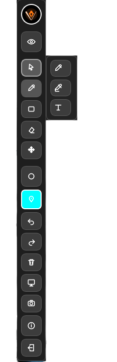
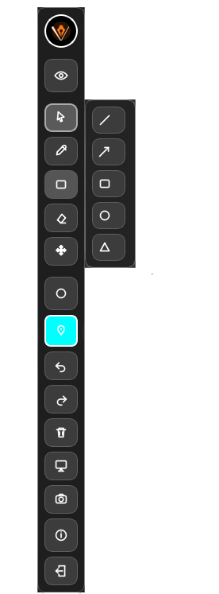
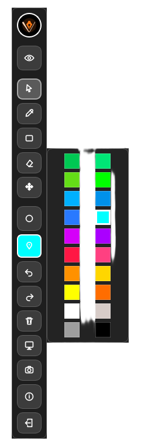

# 🎯 Clarivo

<p align="center">
  
</p>

<p align="center">
  <b>A modern screen annotation tool for teaching, presentations, and live explanations</b>
</p>

<p align="center">
  
  
  
  
</p>

---

## ✨ Overview

Clarivo is a lightweight and powerful screen annotation tool.

It allows you to draw, highlight, write, and interact with your screen in a clean and distraction-free way — perfect for:

- 🧑‍🏫 Teaching
- 🎥 Tutorials
- 🖥️ Presentations
- 🧠 Explanations

---

## 🎥 Preview

<p align="center">
  
</p>

---

## 🔥 Features

- 🖊️ Pen tool (smooth drawing)
- 🟨 Highlighter tool
- 🔤 Text tool
- 🔺 Shapes:
  - Line
  - Rectangle
  - Circle
  - Triangle
  - Arrow
- 🧽 Eraser
- 🖱️ Move & resize elements
- 📸 Screenshot tool (auto-save)
- 🧾 Whiteboard & blackboard modes
- 🎯 Custom cursors
- 🧠 Smart popup positioning (adaptive UI)
- ↩️ Undo / Redo

---

## 📦 Installation (Windows)

### 🔹 Easy Setup

1. Go to:  
   https://github.com/blackroot303/clarivo/releases

2. Download:  
   `clarivo-setup-v1.0.1.exe`

3. Run the installer

4. Launch Clarivo 🚀

---

## 🐧 Run on Linux

### 🔹 Requirements

- Python 3.10+
- pip
- virtual environment support

### 🔹 Steps

```bash
python3 -m venv .venv
source .venv/bin/activate
pip install -r requirements.txt
python3 main.py
```

🛠️ Development

```bash
git clone https://github.com/blackroot303/clarivo.git
cd clarivo
python3 -m venv .venv
source .venv/bin/activate
pip install -r requirements.txt
python3 main.py
```

📸 Screenshots
<p align="center">     </p>

---
🧠 Why Clarivo?

Clarivo focuses on:

⚡ Speed
🎯 Simplicity
🧼 Clean UI
🧑‍🏫 Teaching-friendly workflow

---
👤 Developer

BlackRoot - Katiba

🔗 GitHub:
https://github.com/blackroot303
---
⭐ Support

If you like this project:

⭐ Star the repository
🍴 Fork it
🛠️ Contribute
---
💖 Support the Project

If you find Clarivo useful and want to support its development:
==========
---
₿ Bitcoin
```bash
15rzFWoDMpLLQfvzhw68ikaTMHuNoBBsP3
```
Every contribution helps improve the project 🚀
Thank you for your support ❤️
